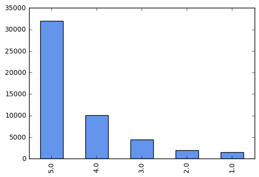

In this ongoing project, I explore different methods for analyzing the sentiment of Amazon reviews.

# Load and Tidy Data

I first need to import the packages I will use.


```python
import pandas as pd
import ast
import time
import re

from sklearn.naive_bayes import MultinomialNB
from sklearn import metrics
from sklearn.cross_validation import train_test_split
from sklearn.feature_extraction.text import CountVectorizer
from sklearn.naive_bayes import MultinomialNB
from sklearn.feature_extraction.text import TfidfVectorizer
from sklearn import svm

%matplotlib inline
```

I will use data from Julian McAuley's [Amazon product dataset](http://jmcauley.ucsd.edu/data/amazon/). To begin, I will use the [subset of Toys and Games data](http://snap.stanford.edu/data/amazon/productGraph/categoryFiles/reviews_Toys_and_Games_5.json.gz). Start by loading the dataset.


```python
# read entire file
with open('reviews_Toys_and_Games_5.json', 'rb') as f:
    data = f.readlines()
    
# remove the trailing "\n" from each element
data = map(lambda x: x.rstrip(), data)
print 'number reviews:', len(data)

# for now, let's restrict to the first 30k obs
# (if I want to run with the full dataset, will probably need to use ec2)
data = data[:50000]

# convert list to a dataframe
t1 = time.time()
df = pd.DataFrame()
count = 0
for r in data:
    r = ast.literal_eval(r)
    s  = pd.Series(r,index=r.keys())
    df = df.append(s,ignore_index=True)
    if count % 1000 ==0:
        print count
    count+=1
t_process = time.time() - t1
print 'process time (seconds):', t_process  #takes 8s for 1000, so should take 8*167/60=22min for 167k
del data

# the above step is slow, so let's write this to csv so we don't have to do it again
# df.to_csv('Toys_and_Games.csv', index=False)
```


```python
df = pd.read_csv('Toys_and_Games.csv')
print df.shape
print df.head(3)
```

    (50000, 9)
             asin helpful  overall  \
    0  0439893577  [0, 0]      5.0   
    1  0439893577  [1, 1]      4.0   
    2  0439893577  [1, 1]      5.0   
    
                                              reviewText   reviewTime  \
    0  I like the item pricing. My granddaughter want...  01 29, 2014   
    1  Love the magnet easel... great for moving to d...  03 28, 2014   
    2  Both sides are magnetic.  A real plus when you...  01 28, 2013   
    
           reviewerID    reviewerName  \
    0  A1VXOAVRGKGEAK           Angie   
    1   A8R62G708TSCM         Candace   
    2  A21KH420DK0ICA  capemaychristy   
    
                                                 summary  unixReviewTime  
    0                                     Magnetic board    1.390954e+09  
    1  it works pretty good for moving to different a...    1.395965e+09  
    2                                         love this!    1.359331e+09  


# Descriptive Statistics

Let's take a look at the distribution of scores across reviews.


```python
df['overall'].value_counts().plot(kind='bar', color='cornflowerblue')
```


    <matplotlib.axes._subplots.AxesSubplot at 0x113e6b610>





# Naive Bayes

Naive Bayes, in short, uses Bayes rule to find the most likely class for each document. In order to do this it makes a couple of strong assumptions that it is worth being aware of: the position of each word in a document doesn't matter (bag of words), and feature probabilities are independent given the class (conditional independence). Jurafsky and Manning have a great introduction to [Naive Bayes and sentiment analysis](https://www.youtube.com/watch?v=c3fnHA6yLeY&list=PL6397E4B26D00A269&index=24). Kevin Markham has [slides](https://github.com/justmarkham/pycon-2016-tutorial) and and accompanying [talk](https://www.youtube.com/watch?v=WHocRqT-KkU) that give an introduction to Naive Bayes in scikit-learn.

First, drop observations containg NaN in review or star rating.


```python
print len(df)
df = df[df['reviewText'].notnull()]
print len(df)
df = df[df['overall'].notnull()]
print len(df)
```

    50000
    49973
    49973


Split into test and training data.


```python
X_train, X_test, y_train, y_test = train_test_split(df['reviewText'], 
                                                   df['overall'],
                                                   test_size=.2, random_state=1)
```

I am going to represent each review as a bag of words, that is, a count of how many times each word appears in a document. Therefore, convert the collection of training reviews into a collection of token counts (a document term matrix).


```python
# instantiate the vectorizer
vect = CountVectorizer()

# tokenize train and test text data
X_train_dtm = vect.fit_transform(X_train)
print "number words in training corpus:", len(vect.get_feature_names())
X_test_dtm = vect.transform(X_test)
```

    number words in training corpus: 36897


Instantiate and train a Multinomial Naive Bayes model.


```python
nb = MultinomialNB()
%time nb.fit(X_train_dtm, y_train)
```

    CPU times: user 85.8 ms, sys: 17.2 ms, total: 103 ms
    Wall time: 111 ms


    MultinomialNB(alpha=1.0, class_prior=None, fit_prior=True)


Evaluate the model.


```python
# make class predictions
y_pred = nb.predict(X_test_dtm)

# calculate accuracy, precision, recall, and F-measure of class predictions
def eval_predictions(y_test, y_pred):
    print 'accuracy:', metrics.accuracy_score(y_test, y_pred)
    print 'precision:', metrics.precision_score(y_test, y_pred, average='weighted')
    print 'recall:', metrics.recall_score(y_test, y_pred, average='weighted')
    print 'F-measure:', metrics.f1_score(y_test, y_pred, average='weighted')
eval_predictions(y_test, y_pred)
```

    accuracy: 0.656828414207
    precision: 0.604801374748
    recall: 0.656828414207
    F-measure: 0.615787875508


Take a look at examples where the model is getting it wrong.


```python
# print message text for the first 3 false positives
print 'False positives:'
print
for x in X_test[y_test < y_pred][:2]:
    print x
    print

# print message text for the first 3 false negatives
print 'False negatives:'
print
for x in X_test[y_test > y_pred][:2]:
    print x[:500]
    print
```

    False positives:
    
    My son loves his Elmo, but I have a couple of gripes.  The hard eyes are annoying - he bangs Elmo on his crib bars and I'm nervous he'll crack the eyes one day.  Fabric would have been much nicer.  Also, Elmo's mouth does not open wide like in the picture.  He's got more of a half open mouth.  Other than that, he's squishy and my son likes him, so in that regard, it's a winner.
    
    My children really enjoyed this toy but I really didn't think it was all that great. The only thing they enjoyed about it was the ball. They threw it around a lot.I couldn't get the animals to stand up right, EVER. It is not educational besides the pins are animals. Since the pins don't stand up though the kids don't really pay attention to them.I ended up giving this toy away to someone who had a baby. I thought maybe it would be better for a baby who is learning how to hold things since the game part just doesn't work.
    
    False negatives:
    
    ASSEMBLY: It comes in pieces (the top part with the picture on it, the two half oval pieces that screw to the bottom, and the dowel that runs between the two half ovals) with six screws. Assembly was smooth, with all the pre-drilled spots lining up, but I highly recommend a drill or electric screwdriver. I tried to be lazy at first and just use a screwdriver I had without reach instead of going out to our shed to get the drill, and I gave up. Granted, I could have persevered by hand but it would
    
    This puzzle is amazing. Great quality! My 4 year old LOVES it and it is one of his favorite toys he got for Christmas this year! He was immediately drawn to it and has played with it multiple times so far. He is fascinated by getting to see the inner parts of his body. However my husband pointed out an interesting point. It goes from surface layer (clothes) to deeper and deeper levels (skin, muscle, internal organs and skeleton) However, the skeleton (rib cage for example) protects the internal 
    


# Naive Bayes: Improving Preprocessing

Tokenization is usually accompanied by other preprocessing steps, such as:
<ol>
<li><i>Make all words lowercase</i></li>
<li><i>Remove punctuation</i></li>
<li><i>Tokenize</i>: divide string into a list of substrings.</li>
<li><i>Remove words not containing letters</i></li>
<li><i>Remove words containing numbers</i></li>
<li><i>Remove stopwords</i>: stopwords are a list of high frequency words like, the, to, and also.</li>
<li><i>Lemmatize</i>: reduces the dimension of the data eby aggregating words that either are the same root or have the same meaning.</li>
</ol>

Let's try including some of these steps and see if it improves our model.


```python
import string
import nltk
from nltk.stem import WordNetLemmatizer

def no_punctuation_unicode(text):
    '''.translate only takes str. Therefore, to use .translate in the 
    tokenizer in TfidfVectorizer I need to write a function that converts 
    unicode -> string, applies .translate, and then converts it back'''
    str_text = str(text)
    no_punctuation = str_text.translate(None, string.punctuation)
    unicode_text = no_punctuation.decode('utf-8')
    return unicode_text

def hasNumbers(inputString):
    return any(char.isdigit() for char in inputString)

stoplist = [word.decode('utf-8') for word in nltk.corpus.stopwords.words('english')] 

wnl = WordNetLemmatizer()

def prep_review(review):
    lower_case = review.lower()
    no_punct = no_punctuation_unicode(lower_case)
    tokens = nltk.word_tokenize(no_punct)    # weird to tokenize within the vectorizer, 
    # but not sure how else to apply functions to each token
    has_letters = [t for t in tokens if re.search('[a-zA-Z]',t)]
    drop_numbers  = [t for t in has_letters if not hasNumbers(t)]
    drop_stops = [t for t in drop_numbers if not t in stoplist] 
    lemmed = [wnl.lemmatize(word) for word in drop_stops]
    return lemmed

# tokenize train and test text data
vect = CountVectorizer(tokenizer=prep_review)
X_train_dtm = vect.fit_transform(X_train)
X_test_dtm = vect.transform(X_test)
```


```python
# instantiate and train model
nb = MultinomialNB()
%time nb.fit(X_train_dtm, y_train)

# evaluate model
y_pred = nb.predict(X_test_dtm)
eval_predictions(y_test, y_pred)
```

    CPU times: user 76.6 ms, sys: 17.6 ms, total: 94.2 ms
    Wall time: 138 ms
    accuracy: 0.647823911956
    precision: 0.563206576672
    recall: 0.647823911956
    F-measure: 0.564786319837


The extra preprocessing has little effect. In fact, our original approach did slightly better. But can we improve with a different algorithm?

# Support Vector Machines (SVMs)

I will also try classifying the reviews using SVMs. SVMs perform classification by constructing hyperlanes to separate different classes. In constructino the hyperlans SVMs try firstly to classify observations correctly, and subject to this constain seek to maximize the margin (the distance between the hyperlane and the nearest point). 

I start by creating a TF-IDF matrix. Rather than just measuring the number of times a word appears in a document, as we did above, we now multiply this by the inverse document frequency (the invester of the number of documents the words appears in). Thus, a words TF-IDF is a measure of relevance. As above, I will initially use limited preprocessing.


```python
tfidf_vectorizer_1 = TfidfVectorizer(min_df=5, max_df=0.8)
tfidf_train_1 = tfidf_vectorizer_1.fit_transform(X_train)
tfidf_test_1 = tfidf_vectorizer_1.transform(X_test)
```

SVM is a classifier built on giving us linear separation. Kernels are the main technique for adapting SVMs to develop non-linear classifiers, by taking a low-dimensional input space and happining it to a higher dimensinoal space. Let's try SVM with both a linear kernel and an rbf (Gaussian) kernel that maps the features to a higher dimensional space.


```python
# instantiate and train model, kernel=rbf 
svm_rbf = svm.SVC(random_state=12345)
%time svm_rbf.fit(tfidf_train_1, y_train)

# evaulate model
y_pred_1 = svm_rbf.predict(tfidf_test_1)
eval_predictions(y_test, y_pred_1)
```

    CPU times: user 16min 18s, sys: 7.27 s, total: 16min 26s
    Wall time: 17min 36s
    accuracy: 0.63871935968
    precision: 0.40796242043
    recall: 0.63871935968
    F-measure: 0.497903949227


```python
# instantiate and train model, kernel=linear
svm_rbf = svm.SVC(kernel='linear', random_state=12345)
%time svm_rbf.fit(tfidf_train_1, y_train)

# evaulate model
y_pred_1 = svm_rbf.predict(tfidf_test_1)
eval_predictions(y_test, y_pred_1)
```

    CPU times: user 21min 41s, sys: 14.9 s, total: 21min 56s
    Wall time: 27min 44s
    accuracy: 0.692146073037
    precision: 0.642945272553
    recall: 0.692146073037
    F-measure: 0.649422858215


Now let's try with the more extensive preprocessing that we used above.


```python
tfidf_vectorizer_2 = TfidfVectorizer(tokenizer=prep_review, min_df=5, max_df=0.8)
tfidf_train_2 = tfidf_vectorizer_2.fit_transform(X_train)
tfidf_test_2 = tfidf_vectorizer_2.transform(X_test)

# kernel=rbf
print 'kernel=rbf'
svm_rbf = svm.SVC(random_state=1)
%time svm_rbf.fit(tfidf_train_2, y_train)
y_pred_2 = svm_rbf.predict(tfidf_test_2)
eval_predictions(y_test, y_pred_2)
print 

print 'kernel=linear'
svm_rbf = svm.SVC(kernel='linear', random_state=1)
%time svm_rbf.fit(tfidf_train_2, y_train)
y_pred_2 = svm_rbf.predict(tfidf_test_2)
eval_predictions(y_test, y_pred_2)
```

    kernel=rbf
    CPU times: user 10min 35s, sys: 4.51 s, total: 10min 40s
    Wall time: 11min 17s
    accuracy: 0.63871935968
    precision: 0.40796242043
    recall: 0.63871935968
    F-measure: 0.497903949227
    
    kernel=linear
    CPU times: user 14min 44s, sys: 4.71 s, total: 14min 49s
    Wall time: 14min 52s
    accuracy: 0.681740870435
    precision: 0.622991495468
    recall: 0.681740870435
    F-measure: 0.628936808344


It is suprising that with an rbf kernel we get exactly the same performance with and without the extra preprocessing steps. I have recoded the variables to ensure I'm not accidentally repeating anything. Let's also print the two vectorizers to check that they are in fact different.


```python
compare_tokens = pd.DataFrame(
    {'unprocessed': tfidf_vectorizer_1.get_feature_names()[:10],
     'preprocessed': tfidf_vectorizer_2.get_feature_names()[:10],
    })
compare_tokens
```


<div>
<table border="1" class="dataframe">
  <thead>
    <tr style="text-align: right;">
      <th></th>
      <th>preprocessed</th>
      <th>unprocessed</th>
    </tr>
  </thead>
  <tbody>
    <tr>
      <th>0</th>
      <td>aa</td>
      <td>00</td>
    </tr>
    <tr>
      <th>1</th>
      <td>aaa</td>
      <td>000</td>
    </tr>
    <tr>
      <th>2</th>
      <td>ab</td>
      <td>01</td>
    </tr>
    <tr>
      <th>3</th>
      <td>aback</td>
      <td>03</td>
    </tr>
    <tr>
      <th>4</th>
      <td>abacus</td>
      <td>04</td>
    </tr>
    <tr>
      <th>5</th>
      <td>abandon</td>
      <td>07</td>
    </tr>
    <tr>
      <th>6</th>
      <td>abandoned</td>
      <td>08</td>
    </tr>
    <tr>
      <th>7</th>
      <td>abby</td>
      <td>09</td>
    </tr>
    <tr>
      <th>8</th>
      <td>abc</td>
      <td>10</td>
    </tr>
    <tr>
      <th>9</th>
      <td>ability</td>
      <td>100</td>
    </tr>
  </tbody>
</table>
</div>


We see that the linear kernel performs best accross all predictive measures, and that we actually get slightly better peformance without precprocessing. Linear kernels often perform well with text classification because when there are a lot of features, mapping the data to a higher dimensional space [does not really improve performance](http://www.svm-tutorial.com/2014/10/svm-linear-kernel-good-text-classification/).

# Conclusions and Next Steps

The most striking findings here are that it preprocessing makes little difference to the performance of our algorithms and that both Naive Bayes and SVMs perform similarly to one another. The latter finding, in particular, is a suprise. Whilst previous research by [Banko and Brill](http://ucrel.lancs.ac.uk/acl/P/P01/P01-1005.pdf) has shown that classifiers perform similarly to one another on extremely large corpora, I was not expecting such similar results with out relatively small sample.

If I have time to pursue this project further, there are a number of steps I would like to take:
<ul>
<li>explore how unusual it is to have my differnet models and classifiers perform so similarly, and triple-check that there is no issue with my code</li>
<li>improve my classifiers, starting by looking at examples that are mislassified
<li>experiment with other classifiers</li>
<li>run my models with a larger dataset, ideally, with 142.8 million reviews in McAuley's full dataset</li>
</ul>
